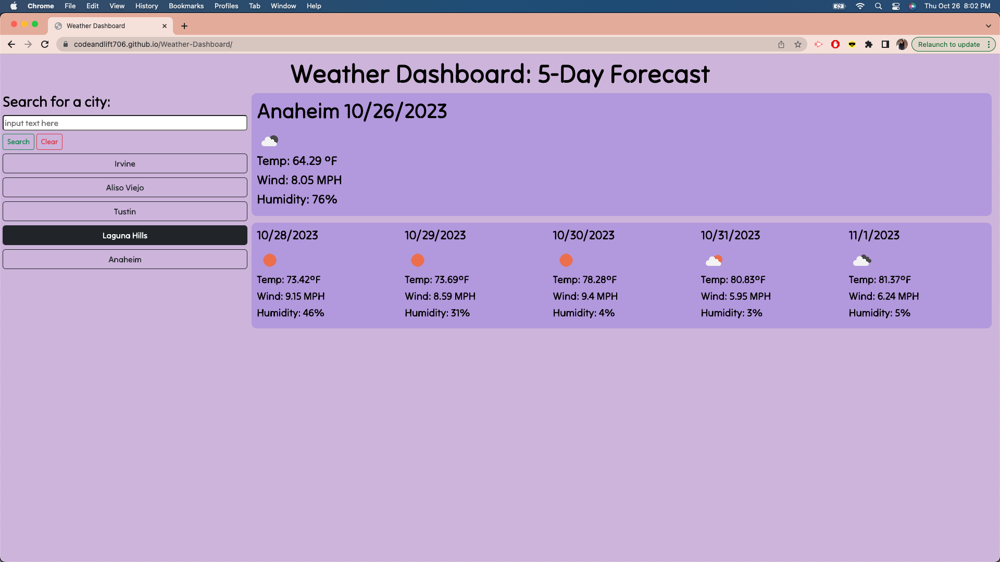

# Weather-Dashboard

## Table of Contents
- [Description](#description)
- [Installation](#installation)
- [Usage](#usage)
- [License](#license)
- [Contribution](#contribution)
- [Questions](#questions)

## Description
The purpose of creating a Weather Dashboard through the browser is for users to retrieve the current weather and the 5-day forecast for any city they search for. The page has a search bar to search for their city, and on click, the 5-day weather forecast renders on the page. Users can view previously searched cities by clicking on them and clear the list with the “clear” button. The deployed application can be found here: https://codeandlift706.github.io/Weather-Dashboard/.

## Installation
VS Code to create and manipulate HTML, CSS, and JavaScript for the application through the web browser. GitHub for version control and web page deployment.
Bootstrap CSS Framework CDN included via CDN: https://getbootstrap.com/.

## Usage
This can be used whenever users need a weather forecast application.

View a screenshot of the homepage with the search bar:

View a screenshot of the searched city’s weather forecast details:

View a screenshot of the searched cities list:

## License
This project is under the MIT license.

## Contribution
The coding (variables, conditional statements, fetch formulas, console logs, functions) -all the additions- that were made to the web page are credited to the curriculum taught in the UCI coding boot camp. The AskBCS learning assistant helped provide guidance with the city buttons and weather icon. A tutor of the boot camp also helped with filtering the API data.

How to make an API call from OpenWeather for a 5-day forecast: https://openweathermap.org/forecast5.

How to make an API call from OpenWeather for the current day: https://openweathermap.org/current.

How to use API keys to set up an API call: https://coding-boot-camp.github.io/full-stack/apis/how-to-use-api-keys.

How to make the API call with a query parameter: https://openweathermap.org/api/geocoding-api. 

Bootstrap CSS framework for the search bar and button styling: https://getbootstrap.com/.

I styled the text with this resource: https://fonts.google.com/specimen/Tilt+Neon?preview.text=Weather%20Dashboard.

The source I used to format the date: https://developer.mozilla.org/en-US/docs/Web/JavaScript/Reference/Global_Objects/Date.

The resource I used to set attributes for dynamically generated elements: https://stackoverflow.com/questions/62355789/add-bootstrap-to-a-dynamically-created-element.

I referenced this to style margins: https://www.w3schools.com/cssref/pr_margin.php. 

The source I referenced for using dot notation to target an item in an array, as a property of an object: https://stackoverflow.com/questions/11922383/how-can-i-access-and-process-nested-objects-arrays-or-json

Where I got the temperature Fahrenheit symbol: https://www.shecodes.io/athena/9891-how-to-add-degree-centigrade-symbol-to-a-temperature-in-javascript

To complete the README with screenshots, the source for the code is: https://stackoverflow.com/questions/10189356/how-to-add-screenshot-to-readmes-in-github-repository. To complete the README section, the source is: https://www.makeareadme.com/. 

## Questions
The link to my Github Profile here: https://github.com/codeandlift706.

For any additional questions, please reach me at: channguyen715@gmail.com.
